# MVP — Pipeline de Dados na Nuvem: mercado de capitalização (SUSEP)

MVP da disciplina de Engenharia de Dados da pós-graduação em Ciência de Dados e Analytics (PUC-Rio). Construí no Databricks Free Edition um pipeline Bronze → Silver → Gold com dados públicos da SUSEP, para entender a estrutura do mercado de títulos de capitalização de 2021 a 2025: quem concentra, onde e com quais produtos.

**Nome:** Joel da Silva Gouveia Junior  
**Matrícula:** 4052026000472  
**Plataforma:** Databricks Free Edition  
**Fonte:** SUSEP/SES (CC BY-ND 3.0)

## Sumário

1. [Contexto de Negócios e Perguntas (Etapa 2 e 4.1)](#contexto-de-negócios-e-perguntas-etapa-2-e-41)
2. [Carga dos Dados (Etapa 4.2)](#carga-dos-dados-etapa-42)
3. [Modelagem e Catálogo de Dados (Etapa 4.3)](#modelagem-e-catálogo-de-dados-etapa-43)
4. [Pipeline de Dados (Etapa 4.4)](#pipeline-de-dados-etapa-44)
5. [Qualidade de Dados (Etapa 4.5)](#qualidade-de-dados-etapa-45)
6. [Análise de Dados (Etapa 4.5)](#análise-de-dados-etapa-45)
7. [Autoavaliação](#autoavaliação)

## Estrutura do repositório

| Caminho | Conteúdo |
|---|---|
| `README.md` | Este documento |
| `manifest_bronze.json` | Manifesto de controle da carga |
| `01_*.ipynb` a `05_*.ipynb` | Os 5 notebooks do pipeline |
| `screenshots/` | Screenshots usados neste README |

Os dados brutos não estão no repositório, por causa da licença (ver "Licença dos dados").

---

## Contexto de Negócios e Perguntas (Etapa 2 e 4.1)

### Contexto de negócio

Títulos de capitalização são produtos regulados pela SUSEP, oferecidos por sociedades de capitalização em seis modalidades. As finalidades variam: guardar dinheiro concorrendo a sorteios (Tradicional), juntar recursos para adquirir um bem ou serviço (Compra-Programada), concorrer a sorteios com pagamentos de baixo valor (Popular), substituir a caução em contratos de aluguel (Instrumento de Garantia), apoiar entidades beneficentes (Filantropia Premiável) ou servir de ferramenta promocional de empresas (Incentivo). O cliente paga, concorre a sorteios durante a vigência e resgata o valor previsto no plano.

Parte de cada pagamento forma uma reserva que pertence ao titular. Para honrar os resgates e sorteios futuros, a companhia mantém provisões, que se acumulam enquanto os títulos estão vigentes. Por isso, o mercado pode ser medido de duas formas: pelos **prêmios**, o que as companhias arrecadam em cada período (fluxo), e pelas **provisões**, o saldo das obrigações com os titulares (estoque). Neste MVP, prêmio é a receita com a venda de títulos, ou seja, os pagamentos feitos pelos clientes. Não se confunde com o valor pago aos ganhadores dos sorteios, que a SUSEP publica à parte como sorteio pago.

### Problema

Neste MVP, quero entender **a estrutura do mercado de capitalização: quem concentra, onde e com quais produtos**. É o tipo de leitura que apoia decisões de posicionamento comercial e de portfólio de uma companhia do setor.

### Perguntas de negócio

| Eixo do problema | Pergunta |
|---|---|
| Quem (estrutura competitiva) | 1. Há concentração de mercado no segmento, com poucas empresas respondendo pela maior parte de prêmios e provisões? |
| Onde (geografia) | 2. O mercado é concentrado geograficamente (poucas UFs) ou pulverizado? Isso mudou ao longo do tempo? |
| Com quais produtos | 3. Quais modalidades de título têm maior representatividade em prêmios, e como essa composição evoluiu no período? |
| Quem × com quais produtos | 4. A receita de cada empresa se concentra em uma modalidade ou se distribui entre várias? Quem lidera cada modalidade? |

**Recorte temporal:** 2021 a 2025, cinco anos civis completos (`damesano` de 202101 a 202512). A base vai até julho de 2026, mas esse ano ficou de fora por estar incompleto.

### Contexto dos dados brutos

Os dados vêm do SES (Sistema de Estatísticas da SUSEP), base pública em que a SUSEP consolida as informações que as companhias supervisionadas enviam todo mês, por obrigação regulatória. Usei 4 arquivos do segmento de capitalização. São dados mensais, agregados por companhia e, conforme o arquivo, por UF ou por modalidade. Não há informação por título nem por cliente. Prêmios, resgates, sorteios e receitas são valores do mês, e a provisão é o saldo no fim do mês.

### Estrutura dos dados brutos

| Arquivo | Conteúdo | Linhas | Período disponível | 1 linha = |
|---|---|---|---|---|
| `ses_cap_uf.csv` | Capitalização — dados por UF | 103.221 | 01/2001 – 07/2026 | empresa × mês × UF |
| `Ses_Dados_Cap.csv` | Capitalização — receitas, resgates e sorteios pagos por modalidade | 8.269 | 01/2014 – 07/2026 | empresa × mês × modalidade |
| `Ses_prov.csv` | Provisão total (todos os mercados supervisionados) | 57.964 | 12/1996 – 07/2026 | empresa × mês |
| `Ses_cias.csv` | Cadastro das companhias do mercado | 769 | — | empresa |

`coenti` (código da empresa) é a chave comum aos 4 arquivos, e `damesano` (ano-mês, `AAAAMM`) é comum aos 3 arquivos de valores.

#### `ses_cap_uf.csv`

| Coluna | Descrição (documentação SUSEP) | Exemplo |
|---|---|---|
| `COENTI` | Código da empresa | `20141` |
| `DAMESANO` | Ano e mês da informação | `200211` |
| `UF` | Unidade Federativa | `DF` |
| `PREMIO` | Prêmios (R$) | `4619484,32` |
| `RESGPAGO` | Resgates pagos (R$) | `2117091,27` |
| `SORTPAGO` | Sorteios pagos (R$) | `125002,9` |
| `NUMPARTIC` | Média de participantes no período | `76850` |
| `RESGATANTES` | Resgatantes | `3804` |
| `SORTEIOS` | Sorteios | `171` |

#### `Ses_Dados_Cap.csv`

| Coluna | Descrição (documentação SUSEP) | Exemplo |
|---|---|---|
| `coenti` | Código da empresa | `21491` |
| `damesano` | Ano e mês da informação | `202005` |
| `codModal` | Código da modalidade | `4` |
| `modalidade` | Descrição da modalidade: Tradicional, Compra-Programada, Popular, Incentivo, Antes Circ 365 e Não Adequado, Filantropia Premiável, Instrumento de Garantia | `Incentivo` |
| `receitasCap` | Total de receitas (R$) | `339666,27` |
| `valorResg` | Total de resgates (R$) | `234361,46` |
| `sorteiosPagos` | Total de sorteios pagos (R$) | `110911,34` |

#### `Ses_prov.csv`

| Coluna | Descrição (documentação SUSEP) | Exemplo |
|---|---|---|
| `coenti` | Código da empresa | `05096` |
| `damesano` | Ano e mês da informação | `200009` |
| `valor` | Total de provisões (R$) | `31323974,9` |

#### `Ses_cias.csv`

| Coluna | Descrição (documentação SUSEP) | Exemplo |
|---|---|---|
| `Coenti` | Código da empresa | `20141` |
| `Noenti` | Nome da empresa | `BRASILCAP CAPITALIZAÇÃO S.A.` |
| `Cogrupo` | Código do grupo econômico ("informação ainda não disponível", vazio em todas as linhas) | — |
| `Nogrupo` | Nome do grupo econômico ("informação ainda não disponível", vazio em todas as linhas) | — |

### Licença dos dados

Os dados estatísticos da SUSEP são publicados sob a licença **Creative Commons Atribuição-SemDerivações 3.0 Não Adaptada (CC BY-ND 3.0)**, conforme declarado no portal da SUSEP ([Dados Estatísticos — SUSEP](https://www.gov.br/susep/pt-br/central-de-conteudos/dados-estatisticos)). Texto da licença: [creativecommons.org/licenses/by-nd/3.0/deed.pt_BR](https://creativecommons.org/licenses/by-nd/3.0/deed.pt_BR).

| Condição | O que significa | Como este MVP atende |
|---|---|---|
| **Atribuição (BY)** | É obrigatório dar crédito à fonte | A SUSEP/SES é citada como fonte neste documento e nas análises |
| **Sem Derivações (ND)** | É proibido distribuir versões modificadas do material | Os dados brutos não são redistribuídos: ficam no ambiente Databricks e não vão para o GitHub, conforme o item 4 da entrega. O repositório contém só código e resultados de análise, sempre com a fonte citada |

São dados públicos e agregados por companhia, sem informação pessoal ou de clientes. Por isso, a regra de anonimização da seção 4.2 não se aplica.

---

## Carga dos Dados (Etapa 4.2)

A SUSEP disponibiliza todos os arquivos CSV do SES em um único ZIP para download, então fiz a carga por upload: baixei o ZIP no portal do SES e subi os arquivos para um Volume no Databricks.

### Download

Além do ZIP (`BaseCompleta.zip`), baixei a documentação oficial das tabelas (`Documentacao_das_tabelas.rtf`).

Do ZIP, extraí só os 4 arquivos com os dados necessários para as perguntas de negócio. Não mexi no conteúdo: nenhuma linha removida, nenhuma conversão de encoding.

| Arquivo | Encoding |
|---|---|
| `ses_cap_uf.csv` | ASCII |
| `Ses_Dados_Cap.csv` | ISO-8859-1 |
| `Ses_prov.csv` | ASCII |
| `Ses_cias.csv` | Windows-1252 |

Todos usam `;` como separador.

### Manifesto de controle

Antes de subir os arquivos, contei as linhas de cada um na minha máquina e registrei o resultado, junto com separador e encoding, num arquivo de controle: [`manifest_bronze.json`](manifest_bronze.json).

A ideia é ter uma referência que não depende do Databricks. Se a contagem feita lá dentro bater com a do manifesto, sei que nada se perdeu ou duplicou no upload. O manifesto está versionado no repositório. O script que o gerou foi usado uma única vez, na mesma etapa do download, e por isso ficou fora do repositório.

### Upload para o Databricks

Criei um **Managed Volume** no Unity Catalog e subi os 4 arquivos pela interface do Catalog Explorer:

```
/Volumes/susep_capitalizacao/bronze/raw_susep_capitalizacao/
```

O Volume fica no catálogo `susep_capitalizacao`, schema `bronze`. Os arquivos estão lá exatamente como vieram da SUSEP; limpeza e tipagem só começam na camada Silver.

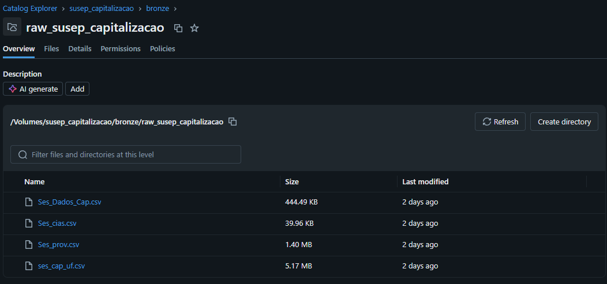

### Validação

O notebook [`01_bronze_ingestao_susep.ipynb`](01_bronze_ingestao_susep.ipynb) lê cada arquivo do Volume usando o separador e o encoding registrados no manifesto, conta as linhas e compara com o valor esperado.

| Arquivo | Linhas esperadas (manifesto) | Linhas lidas no Databricks | Status |
|---|---|---|---|
| `ses_cap_uf.csv` | 103.221 | 103.221 | OK |
| `Ses_Dados_Cap.csv` | 8.269 | 8.269 | OK |
| `Ses_prov.csv` | 57.964 | 57.964 | OK |
| `Ses_cias.csv` | 769 | 769 | OK |

As 4 contagens bateram: nenhuma linha se perdeu ou foi duplicada no upload.

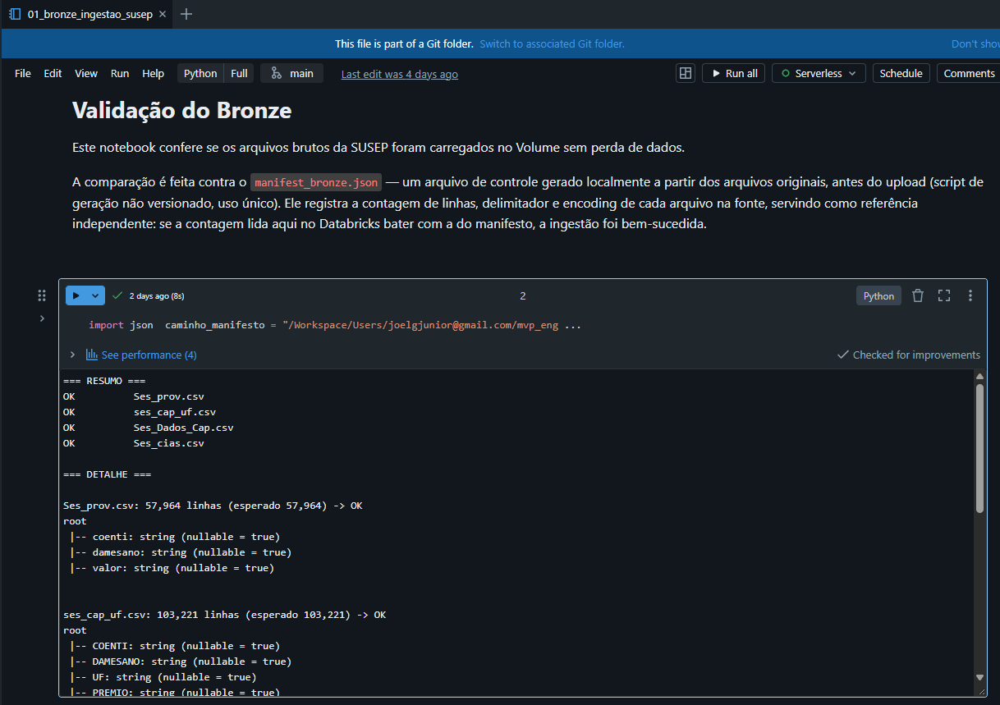

---

## Modelagem e Catálogo de Dados (Etapa 4.3)

### Modelagem

#### Abordagem

Os dados seguem a arquitetura **Medallion** no Databricks. Cada camada fica em um schema do catálogo `susep_capitalizacao`:

| Camada | Schema | Conteúdo | Modelo |
|---|---|---|---|
| Bronze | `bronze` | 4 CSVs originais no Volume `raw_susep_capitalizacao`, sem alteração | Arquivo bruto |
| Silver | `silver` | 1 tabela limpa e tipada por arquivo de origem, filtrada para 2021–2025 | Flat (1 tabela por conceito) |
| Gold | `gold` | Tabelas fato e dimensão que respondem às perguntas de negócio | **Modelo dimensional — Esquema Estrela (Kimball)** |

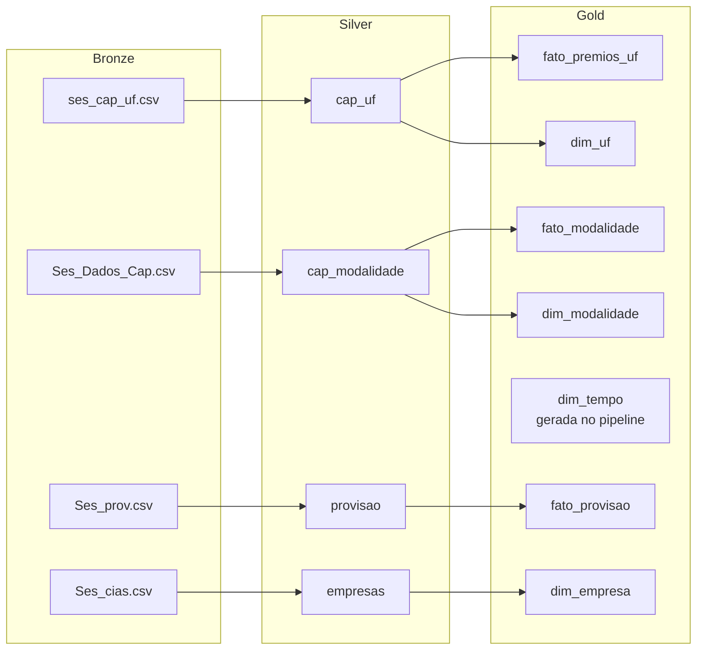
```mermaid
flowchart LR
    subgraph Bronze
        B1[ses_cap_uf.csv]
        B2[Ses_Dados_Cap.csv]
        B3[Ses_prov.csv]
        B4[Ses_cias.csv]
    end
    subgraph Silver
        S1[cap_uf]
        S2[cap_modalidade]
        S3[provisao]
        S4[empresas]
    end
    subgraph Gold
        F1[fato_premios_uf]
        F2[fato_modalidade]
        F3[fato_provisao]
        D1[dim_empresa]
        D2[dim_tempo<br>gerada no pipeline]
        D3[dim_uf]
        D4[dim_modalidade]
    end
    B1 --> S1 --> F1
    S1 --> D3
    B2 --> S2 --> F2
    S2 --> D4
    B3 --> S3 --> F3
    B4 --> S4 --> D1
```

A camada Gold é um **Esquema Estrela com 3 tabelas fato compartilhando 4 dimensões conformadas**, variação também conhecida como **constelação de fatos**. Cada fato, olhada isoladamente, forma uma estrela completa.

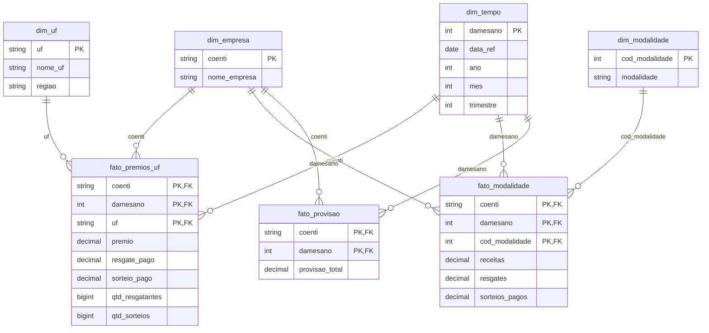
```mermaid
erDiagram
    dim_empresa ||--o{ fato_premios_uf : "coenti"
    dim_empresa ||--o{ fato_modalidade : "coenti"
    dim_empresa ||--o{ fato_provisao   : "coenti"
    dim_tempo   ||--o{ fato_premios_uf : "damesano"
    dim_tempo   ||--o{ fato_modalidade : "damesano"
    dim_tempo   ||--o{ fato_provisao   : "damesano"
    dim_uf         ||--o{ fato_premios_uf : "uf"
    dim_modalidade ||--o{ fato_modalidade : "cod_modalidade"

    dim_empresa {
        string coenti PK
        string nome_empresa
    }
    dim_tempo {
        int damesano PK
        date data_ref
        int ano
        int mes
        int trimestre
    }
    dim_uf {
        string uf PK
        string nome_uf
        string regiao
    }
    dim_modalidade {
        int cod_modalidade PK
        string modalidade
    }
    fato_premios_uf {
        string coenti PK, FK
        int damesano PK, FK
        string uf PK, FK
        decimal premio
        decimal resgate_pago
        decimal sorteio_pago
        bigint qtd_resgatantes
        bigint qtd_sorteios
    }
    fato_modalidade {
        string coenti PK, FK
        int damesano PK, FK
        int cod_modalidade PK, FK
        decimal receitas
        decimal resgates
        decimal sorteios_pagos
    }
    fato_provisao {
        string coenti PK, FK
        int damesano PK, FK
        decimal provisao_total
    }
```

#### Justificativa

Escolhi o esquema estrela porque as quatro perguntas são somas e participações de medidas (prêmio, receita e provisão) por empresa, UF, modalidade e tempo, que é o uso típico do modelo dimensional. As dimensões são pequenas (19 empresas, 27 UFs, 7 modalidades e 60 meses), e normalizá-las num snowflake só acrescentaria joins. Mantive três fatos porque as fontes têm grãos diferentes (por UF, por modalidade e só por empresa), e UF e modalidade nunca aparecem cruzadas. Como `dim_empresa` e `dim_tempo` são compartilhadas pelas três fatos, dá para combiná-las na mesma análise, como na pergunta 1, que usa prêmios e provisões.

---

### Catálogo de Dados

**Convenções:**

- Valores monetários em R$, tipo `decimal(18,2)`, convertidos do formato de origem com vírgula decimal (`84,91` → `84.91`).
- Período das tabelas com `damesano`: 202101 a 202512.
- O domínio indica os valores **esperados**. Valores fora do domínio encontrados nos dados brutos são tratados na seção Qualidade de Dados.

#### Camada Silver

| Tabela | Descrição | Colunas | Linhagem |
|---|---|---|---|
| `silver.cap_uf` | Prêmios, resgates e sorteios por empresa, mês e UF | As mesmas de `gold.fato_premios_uf` | `bronze/ses_cap_uf.csv` → filtro de período → tipagem → `upper(UF)`, negativos de resgates, sorteios e quantidades substituídos por zero, quantidades arredondadas |
| `silver.cap_modalidade` | Receitas, resgates e sorteios pagos por empresa, mês e modalidade | As de `gold.fato_modalidade` + `modalidade` (descrição) | `bronze/Ses_Dados_Cap.csv` → filtro de período → tipagem → código 0 recebe "Não informada" |
| `silver.provisao` | Provisão total por empresa e mês | As mesmas de `gold.fato_provisao` | `bronze/Ses_prov.csv` → filtro de período e das empresas de `silver.empresas` → tipagem → remoção de duplicatas exatas (`DISTINCT`) |
| `silver.empresas` | Cadastro das empresas de capitalização | As mesmas de `gold.dim_empresa` | `bronze/Ses_cias.csv` → `trim` → filtro: empresas presentes em `ses_cap_uf` ou `Ses_Dados_Cap` no período |

Tipos, descrições e domínios das colunas estão nas tabelas Gold abaixo.

#### Camada Gold — Dimensões

##### `gold.dim_empresa`

Companhias de capitalização supervisionadas pela SUSEP presentes em `ses_cap_uf` ou `Ses_Dados_Cap` no período. 19 linhas.
**Linhagem:** `Ses_cias.csv` → `silver.empresas`.

| Coluna | Descrição | Tipo | Domínio | Linhagem |
|---|---|---|---|---|
| `coenti` | Código da empresa na SUSEP (**PK**) | string | 5 dígitos; único | `Ses_cias.Coenti` (`trim`) |
| `nome_empresa` | Razão social da empresa | string | Texto livre, não nulo | `Ses_cias.Noenti` (`trim`) |

##### `gold.dim_tempo`

Calendário mensal do período analisado. 60 linhas.
**Linhagem:** gerada no pipeline (sequência de meses de 202101 a 202512).

| Coluna | Descrição | Tipo | Domínio | Linhagem |
|---|---|---|---|---|
| `damesano` | Ano-mês no formato `AAAAMM` (**PK**) | int | 202101 a 202512 | Gerado |
| `data_ref` | Primeiro dia do mês | date | 2021-01-01 a 2025-12-01 | Derivado de `damesano` |
| `ano` | Ano | int | 2021 a 2025 | Derivado de `damesano` |
| `mes` | Mês | int | 1 a 12 | Derivado de `damesano` |
| `trimestre` | Trimestre do ano | int | 1 a 4 | Derivado de `mes` |

##### `gold.dim_uf`

Unidades Federativas do Brasil. 27 linhas.
**Linhagem:** siglas distintas de `ses_cap_uf.csv` (`upper`) + nome e região conforme a divisão regional do IBGE (mapeamento fixo no pipeline).

| Coluna | Descrição | Tipo | Domínio | Linhagem |
|---|---|---|---|---|
| `uf` | Sigla da UF (**PK**) | string | 27 siglas (AC … TO) | `ses_cap_uf.UF` (`upper`) |
| `nome_uf` | Nome da UF | string | 27 nomes | Mapeamento IBGE |
| `regiao` | Região geográfica | string | Norte, Nordeste, Centro-Oeste, Sudeste, Sul | Mapeamento IBGE |

##### `gold.dim_modalidade`

Modalidades de título de capitalização. 7 linhas: o código 2 (Compra-Programada) não aparece em 2021–2025.
**Linhagem:** pares distintos (`codModal`, `modalidade`) de `Ses_Dados_Cap.csv`.

| Coluna | Descrição | Tipo | Domínio | Linhagem |
|---|---|---|---|---|
| `cod_modalidade` | Código da modalidade (**PK**) | int | 0, 1, 3, 4, 5, 6, 7 | `Ses_Dados_Cap.codModal` |
| `modalidade` | Descrição da modalidade | string | Tradicional, Popular, Incentivo, Antes Circ 365 e Não Adequado, Filantropia Premiável, Instrumento de Garantia, Não informada | `Ses_Dados_Cap.modalidade`; código 0, com descrição vazia na origem, recebe "Não informada" |

#### Camada Gold — Fatos

##### `gold.fato_premios_uf`

Movimento mensal de títulos de capitalização por empresa e UF. Snapshot periódico mensal; medidas aditivas.
**Grão:** empresa × mês × UF. **PK:** (`coenti`, `damesano`, `uf`).
**Linhagem:** `ses_cap_uf.csv` → `silver.cap_uf`.

| Coluna | Descrição | Tipo | Domínio | Linhagem |
|---|---|---|---|---|
| `coenti` | Empresa (**PK**, **FK** → `dim_empresa`) | string | Códigos existentes em `dim_empresa` | `ses_cap_uf.COENTI` |
| `damesano` | Mês de referência (**PK**, **FK** → `dim_tempo`) | int | 202101 a 202512 | `ses_cap_uf.DAMESANO` |
| `uf` | UF (**PK**, **FK** → `dim_uf`) | string | 27 siglas | `ses_cap_uf.UF` (`upper`) |
| `premio` | Prêmios do mês, líquidos de devoluções e cancelamentos (R$) | decimal(18,2) | Pode ser negativo quando as devoluções e cancelamentos superam a arrecadação no mês | `ses_cap_uf.PREMIO` |
| `resgate_pago` | Resgates pagos no mês (R$) | decimal(18,2) | ≥ 0 | `ses_cap_uf.RESGPAGO` (negativos substituídos por zero) |
| `sorteio_pago` | Sorteios pagos no mês (R$) | decimal(18,2) | ≥ 0 | `ses_cap_uf.SORTPAGO` (negativos substituídos por zero) |
| `qtd_resgatantes` | Quantidade de resgatantes no mês | bigint | ≥ 0 | `ses_cap_uf.RESGATANTES` (arredondado para inteiro; negativos substituídos por zero) |
| `qtd_sorteios` | Quantidade de sorteios no mês | bigint | ≥ 0 | `ses_cap_uf.SORTEIOS` (arredondado para inteiro; negativos substituídos por zero) |

##### `gold.fato_modalidade`

Movimento mensal de títulos de capitalização por empresa e modalidade. Snapshot periódico mensal; medidas aditivas.
**Grão:** empresa × mês × modalidade. **PK:** (`coenti`, `damesano`, `cod_modalidade`).
**Linhagem:** `Ses_Dados_Cap.csv` → `silver.cap_modalidade`.

| Coluna | Descrição | Tipo | Domínio | Linhagem |
|---|---|---|---|---|
| `coenti` | Empresa (**PK**, **FK** → `dim_empresa`) | string | Códigos existentes em `dim_empresa` | `Ses_Dados_Cap.coenti` |
| `damesano` | Mês de referência (**PK**, **FK** → `dim_tempo`) | int | 202101 a 202512 | `Ses_Dados_Cap.damesano` |
| `cod_modalidade` | Modalidade (**PK**, **FK** → `dim_modalidade`) | int | 0, 1, 3, 4, 5, 6, 7 | `Ses_Dados_Cap.codModal` |
| `receitas` | Receitas com títulos no mês, líquidas de devoluções e cancelamentos (R$) | decimal(18,2) | Pode ser negativo quando as devoluções e cancelamentos superam a arrecadação no mês | `Ses_Dados_Cap.receitasCap` |
| `resgates` | Resgates no mês (R$) | decimal(18,2) | ≥ 0 | `Ses_Dados_Cap.valorResg` |
| `sorteios_pagos` | Sorteios pagos no mês (R$) | decimal(18,2) | ≥ 0 | `Ses_Dados_Cap.sorteiosPagos` |

##### `gold.fato_provisao`

Saldo mensal da provisão total das empresas de capitalização. Snapshot periódico mensal; medida **semiaditiva**.
**Grão:** empresa × mês. **PK:** (`coenti`, `damesano`).
**Linhagem:** `Ses_prov.csv` (todos os mercados) → `silver.provisao` (só empresas de `dim_empresa`).

| Coluna | Descrição | Tipo | Domínio | Linhagem |
|---|---|---|---|---|
| `coenti` | Empresa (**PK**, **FK** → `dim_empresa`) | string | Códigos existentes em `dim_empresa` | `Ses_prov.coenti` |
| `damesano` | Mês de referência (**PK**, **FK** → `dim_tempo`) | int | 202101 a 202512 | `Ses_prov.damesano` |
| `provisao_total` | Saldo da provisão total no fim do mês (R$). Não somar entre meses | decimal(18,2) | ≥ 0 | `Ses_prov.valor` |

---

### Evidências no Unity Catalog

As tabelas da Gold foram criadas com DDL explícito: tipo e descrição (`COMMENT`) de cada tabela e coluna, e chaves primária e estrangeira declaradas. Assim, o catálogo acima também fica registrado no próprio Unity Catalog.

No Databricks, PK e FK são informativas: documentam o modelo e desenham as relações no Catalog Explorer, mas não são validadas na gravação. Por isso, a unicidade das chaves e a integridade referencial são conferidas por checagens no notebook [`04_gold_modelagem.ipynb`](04_gold_modelagem.ipynb) (ver "Qualidade de Dados").

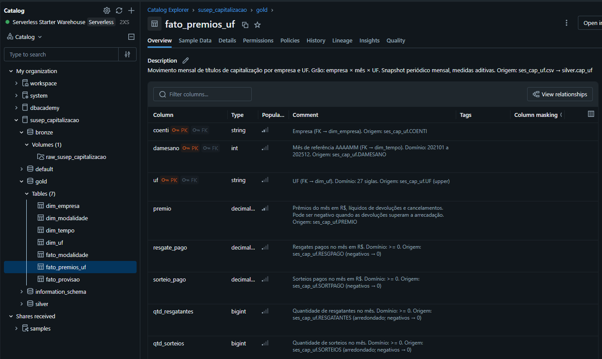

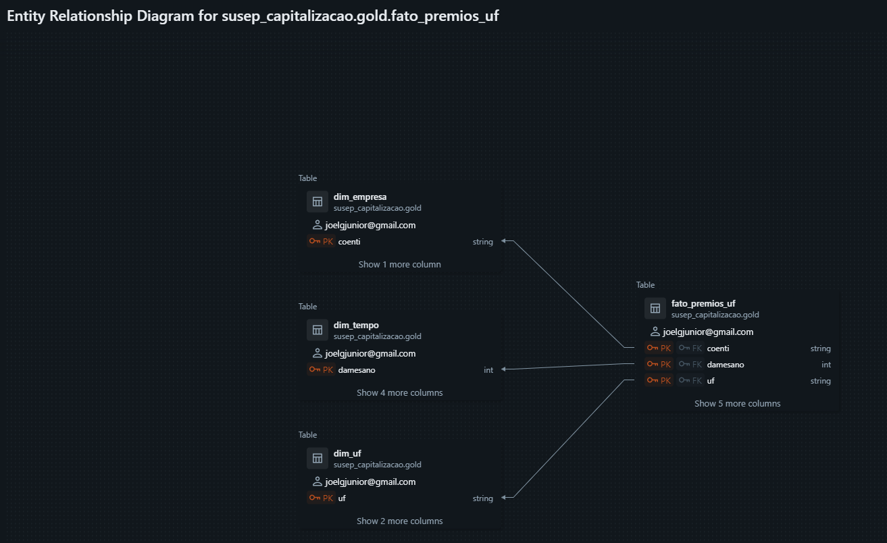

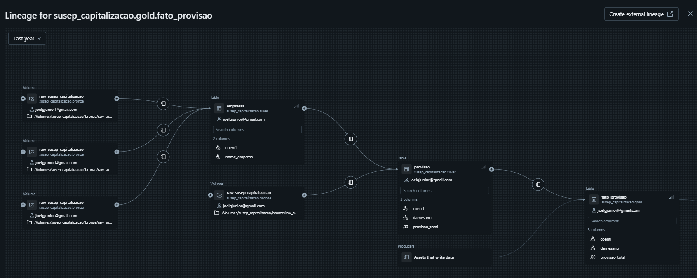

---

## Pipeline de Dados (Etapa 4.4)

Organizei o pipeline na arquitetura Medallion (Bronze → Silver → Gold), em 5 notebooks, um por etapa. Todos ficam num Git Folder do Databricks ligado ao repositório do GitHub, e cada etapa foi commitada ao terminar.

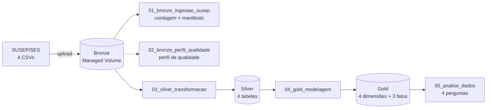
```mermaid
flowchart LR
    A[SUSEP/SES<br>4 CSVs] -->|upload| B[(Bronze<br>Managed Volume)]
    B --> N1[01_bronze_ingestao_susep<br>contagem × manifesto]
    B -.-> N2[02_bronze_perfil_qualidade<br>perfil de qualidade]
    B --> N3[03_silver_transformacao]
    N3 --> S[(Silver<br>4 tabelas)]
    S --> N4[04_gold_modelagem]
    N4 --> G[(Gold<br>4 dimensões + 3 fatos)]
    G --> N5[05_analise_dados<br>4 perguntas]
```

| Notebook | Camada | O que faz | Saída |
|---|---|---|---|
| [`01_bronze_ingestao_susep`](01_bronze_ingestao_susep.ipynb) | Bronze | Lê os 4 CSVs do Volume e compara a contagem de linhas com o `manifest_bronze.json` | 4 × OK |
| [`02_bronze_perfil_qualidade`](02_bronze_perfil_qualidade.ipynb) | Bronze | Perfil dos dados brutos nas 5 dimensões de qualidade. É exploração: rodou uma vez e orientou os tratamentos da Silver | Diagnóstico (ver "Qualidade de Dados") |
| [`03_silver_transformacao`](03_silver_transformacao.ipynb) | Silver | Filtra o período (e, na provisão, as empresas de capitalização), tipa as colunas e aplica os tratamentos. Termina com a conciliação de completude | `silver.empresas`, `cap_uf`, `cap_modalidade`, `provisao` |
| [`04_gold_modelagem`](04_gold_modelagem.ipynb) | Gold | Cria o esquema estrela com DDL explícito (tipos, `COMMENT`, PK e FK) e carrega com `INSERT`. Termina com as checagens de unicidade e integridade referencial | 4 dimensões e 3 fatos |
| [`05_analise_dados`](05_analise_dados.ipynb) | Consumo | Responde às 4 perguntas consultando só a Gold | Tabelas, gráficos e discussão |

**Como cada camada é gravada**

| Camada | Técnica | Por quê |
|---|---|---|
| Bronze | Arquivos originais no Volume, sem alteração | Guardar o dado bruto como veio da fonte |
| Silver | Temp view sobre o CSV + `CREATE TABLE ... AS SELECT` (CTAS) | A view lê o arquivo; o CTAS grava o resultado tratado como tabela Delta |
| Gold | `CREATE TABLE` com colunas, tipos e `COMMENT` + `INSERT` | Deixar tipos, descrições e chaves registrados no Unity Catalog |

Os notebooks rodam em sequência (01 → 03 → 04 → 05). O 02 fica fora do fluxo de carga, porque é uma análise exploratória.

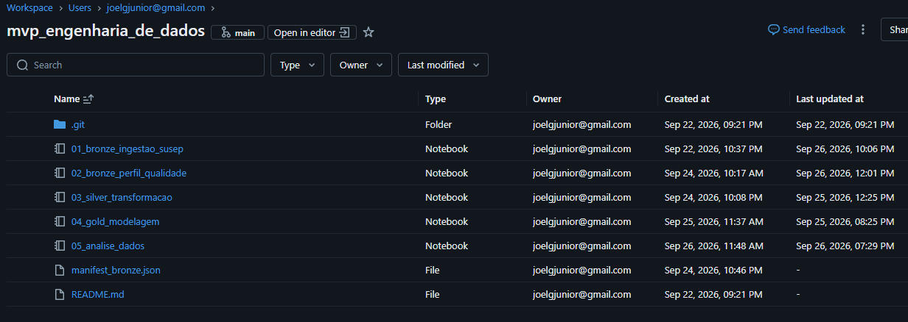

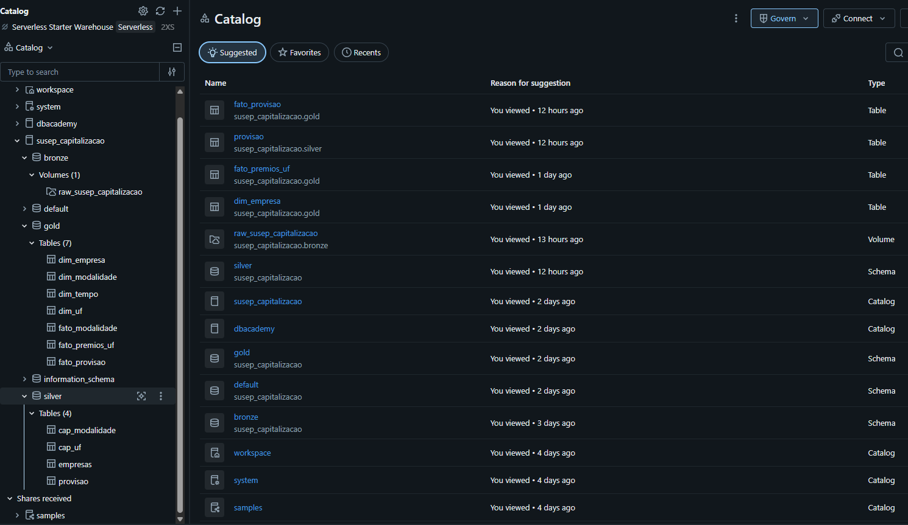

---

## Qualidade de Dados (Etapa 4.5)

Antes de transformar os dados, fiz um perfil do Bronze, atributo por atributo, nas 5 dimensões de qualidade. O perfil está no notebook [`02_bronze_perfil_qualidade.ipynb`](02_bronze_perfil_qualidade.ipynb). Abaixo estão os problemas encontrados e como cada um foi tratado.

### Completude

**Carga.** A primeira checagem de completude foi a da carga: as 4 contagens de linhas bateram com o manifesto (ver "Carga dos Dados").

**Atributos.** Em seguida, medi valores nulos ou vazios em cada coluna dos 4 arquivos.

| Arquivo | Coluna | O que encontrei | Tratamento |
|---|---|---|---|
| `Ses_Dados_Cap.csv` | `modalidade` | 301 linhas sem descrição, todas com `codModal = 0`: um código que a SUSEP publica sem nome. As demais modalidades sempre vêm com descrição, inclusive nas linhas com receita, resgate e sorteio zerados | Mantido no pipeline, com a descrição "Não informada" |
| `Ses_cias.csv` | `Cogrupo`, `Nogrupo` | Vazias em todas as linhas (preenchidas só com espaços). A documentação da SUSEP indica "informação ainda não disponível" | Nenhum: as colunas não fazem parte do modelo |

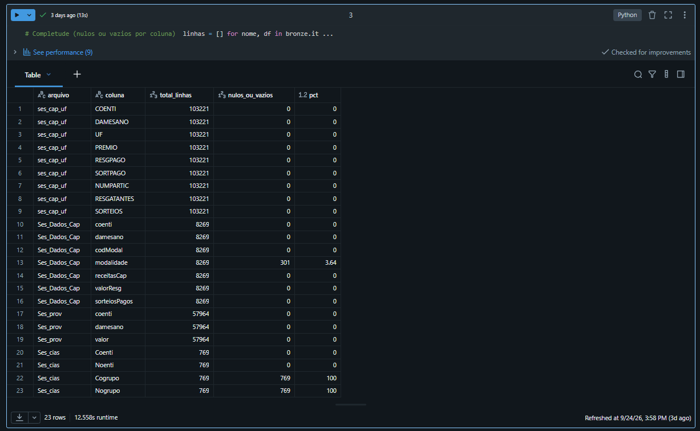

### Unicidade

| Arquivo | Chave | O que encontrei | Tratamento |
|---|---|---|---|
| `Ses_prov.csv` | `coenti` + `damesano` | 5 chaves duplicadas, todas em 01/2001. As 5 são duplicatas exatas (linhas idênticas em todas as colunas), sem nenhuma duplicata conflitante (mesma chave com valores diferentes). Nos demais arquivos, nenhuma duplicata | Remoção de duplicatas exatas na Silver. As linhas também ficam fora do período analisado (2021–2025) |

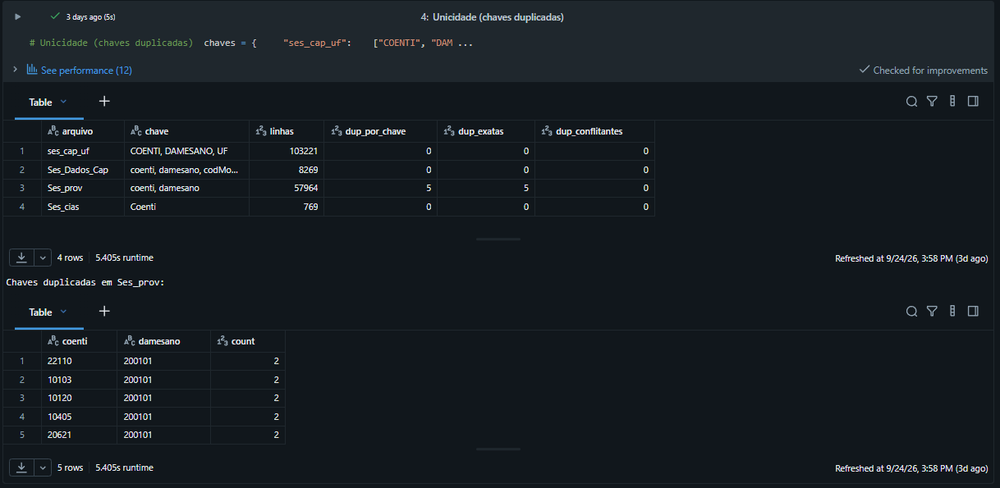

### Consistência

Cada coluna foi testada contra uma regra de formato (código de 5 dígitos, ano-mês `AAAAMM`, sigla de UF, número decimal ou inteiro). Separei **conteúdo inválido** de **espaços sobrando nas pontas**, que é só formatação.

| Arquivo | Coluna | O que encontrei | Tratamento |
|---|---|---|---|
| `ses_cap_uf.csv` | `UF` | 1 linha com `Am` em vez de `AM` (01/2024) | `upper()` na Silver |
| `ses_cap_uf.csv` | `RESGATANTES`, `SORTEIOS` | Contagens com casas decimais, quando o esperado são números inteiros: 51 e 57 linhas na base, 27 e 26 no período. No período, todas são da mesma empresa e mês (21661, 09/2024), em todas as UFs | Arredondamento para inteiro na Silver, para manter o tipo da coluna e deixar o dado disponível para análises futuras |
| `ses_cap_uf.csv` | `NUMPARTIC` | Valores com casas decimais, esperados: a coluna é a *média* de participantes no período | Nada a reportar |
| `Ses_cias.csv` | `Coenti`, `Noenti` | Códigos completados com espaços até 10 caracteres e 44 nomes com espaço nas pontas. O conteúdo está correto | `trim()` na Silver |
| `Ses_Dados_Cap.csv` | `coenti` | A empresa 28932 só aparece no período com valores zerados, e não aparece no `ses_cap_uf` | Nada a reportar: linhas zeradas não alteram somas nem participações |

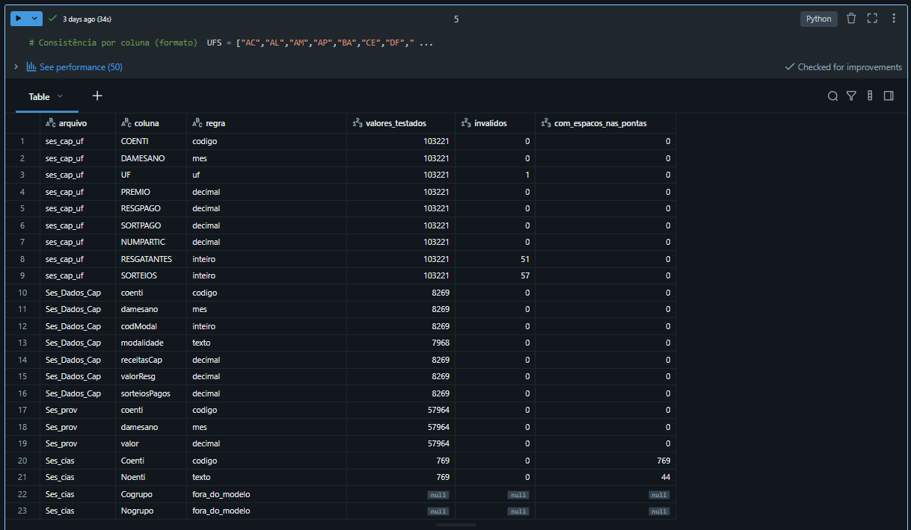

Também verifiquei a consistência entre colunas e arquivos, sem nenhum problema encontrado:

| Verificação | Resultado |
|---|---|
| Toda empresa de `ses_cap_uf`, `Ses_Dados_Cap` e `Ses_prov` existe no cadastro `Ses_cias` | Nenhuma empresa sem cadastro |
| Cada código de modalidade tem uma única descrição | Sim (o código 0 sempre sem descrição, conforme a Completude) |

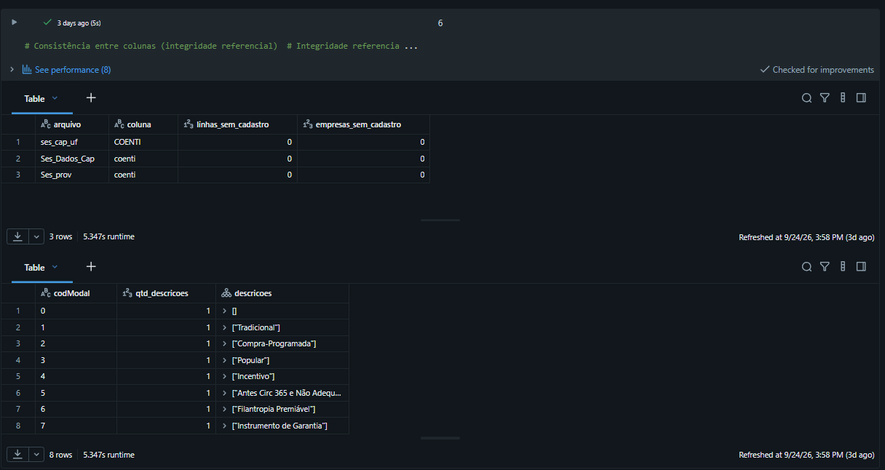

### Acurácia

Verifiquei os valores negativos de cada medida, na base inteira e no período analisado. Em prêmios e receitas, que são líquidos de devoluções e cancelamentos, o negativo é possível. Em pagamentos e contagens, não.

| Arquivo | Coluna | O que encontrei | Tratamento |
|---|---|---|---|
| `ses_cap_uf.csv` | `PREMIO` | 841 linhas negativas na base, 258 no período. Não é erro: o prêmio é líquido de devoluções e cancelamentos de títulos. Conferi um caso (empresa 26026, 01/2021) contra a demonstração de resultado da empresa | Mantido como veio |
| `Ses_Dados_Cap.csv` | `receitasCap` | 68 linhas negativas no período, pelo mesmo motivo do `PREMIO` | Mantido como veio |
| `ses_cap_uf.csv` | `NUMPARTIC` | 801 linhas negativas na base, 239 no período, quase todas com o `PREMIO` também negativo: a coluna é líquida de devoluções, como o prêmio | Nada a reportar (coluna fora do modelo) |
| `ses_cap_uf.csv` | `RESGPAGO`, `SORTPAGO`, `RESGATANTES`, `SORTEIOS` | Negativos sem explicação na documentação. No período, só 2 linhas em `SORTPAGO` e 2 em `RESGATANTES`, estas com valores impossíveis (até −113 milhões de resgatantes) | Negativos substituídos por zero na Silver |

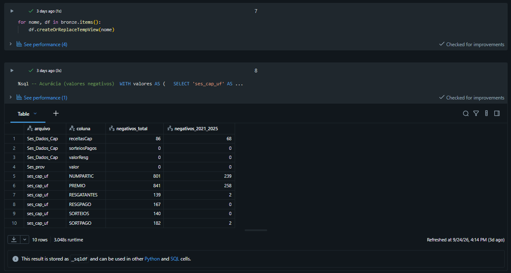

### Outliers

Olhei o prêmio anual de cada empresa no período analisado, com um boxplot por ano. Pela regra de Tukey, a mesma que o boxplot usa para desenhar os pontos isolados, é outlier o valor acima de Q3 + 1,5 × (Q3 − Q1).

| Arquivo | Coluna | O que encontrei | Tratamento |
|---|---|---|---|
| `ses_cap_uf.csv` | `PREMIO` (soma anual por empresa) | Bradesco e Brasilcap são outliers em todos os anos, e o Santander também em 2022. Não são erros: são as líderes do mercado, com prêmio muito acima das demais empresas | Mantidos. A análise trabalha com totais e participações (%), e não com médias, então esses valores não distorcem o resultado. Os outliers mostram a **diferença de porte** entre as líderes e as demais empresas, o que não significa, por si só, um mercado concentrado. A concentração é medida na Análise de Dados (pergunta 1), com as participações das maiores empresas e o HHI |

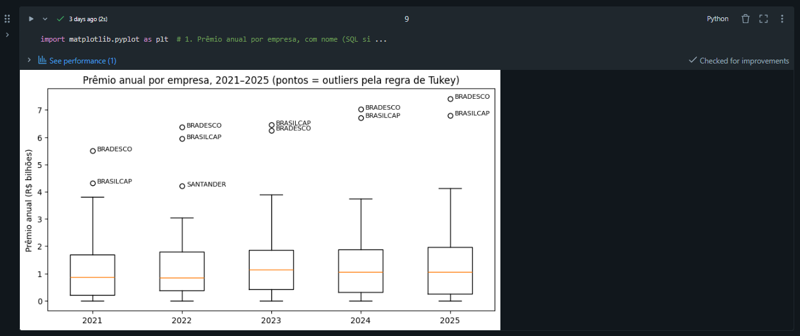

### Checagens depois da transformação

O perfil acima diagnosticou os dados de entrada. Depois de transformar, conferi se o pipeline fez o que devia: uma conciliação na Silver e duas checagens na Gold.

**Silver: completude.** No notebook [`03_silver_transformacao.ipynb`](03_silver_transformacao.ipynb), concilio a quantidade de linhas do Bronze, com as mesmas regras de filtro (período e empresas), com a da Silver. A diferença zero mostra que nenhuma linha se perdeu ou duplicou na transformação.

| Tabela | Bronze (total) | Bronze (com os filtros) | Silver | Diferença |
|---|---|---|---|---|
| `empresas` | 769 | 19 | 19 | 0 |
| `cap_uf` | 103.221 | 23.169 | 23.169 | 0 |
| `cap_modalidade` | 8.269 | 3.609 | 3.609 | 0 |
| `provisao` | 57.964 | 1.091 | 1.091 | 0 |

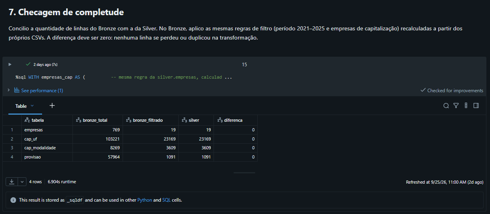

**Gold: unicidade e integridade referencial.** No Databricks, as chaves primária e estrangeira declaradas não são validadas na gravação (ver [Evidências no Unity Catalog](#evidências-no-unity-catalog)). Por isso, no notebook [`04_gold_modelagem.ipynb`](04_gold_modelagem.ipynb), confirmo as duas regras com consultas.

| Checagem | Regra | Resultado |
|---|---|---|
| Unicidade | `COUNT(*)` = `COUNT(DISTINCT pk)` em cada uma das 7 tabelas | OK nas 7 |
| Integridade referencial | Toda chave estrangeira das 3 fatos existe na dimensão correspondente (8 relações) | 0 órfãos |

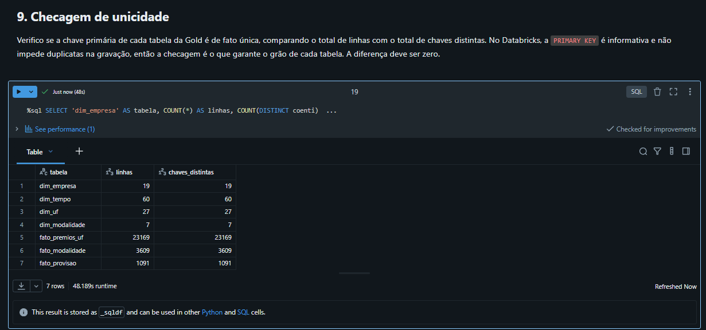

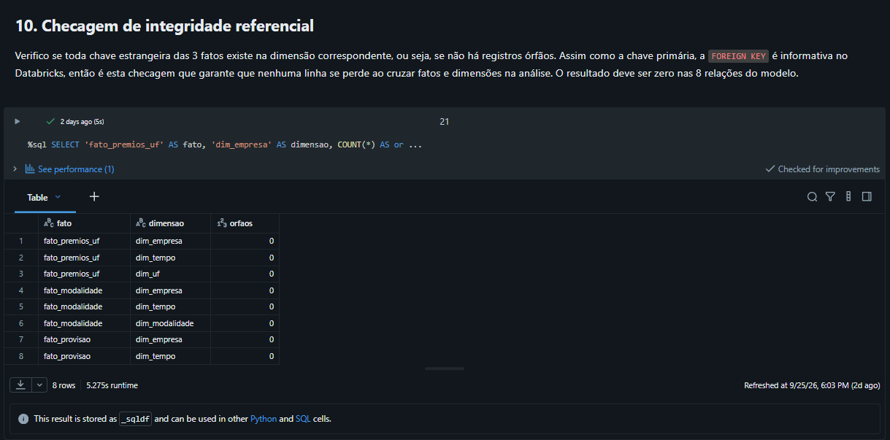

---

## Análise de Dados (Etapa 4.5)

As consultas e os gráficos estão no notebook [`05_analise_dados.ipynb`](05_analise_dados.ipynb).

### Recortes da análise

#### Modalidades 0 e 5

Duas modalidades de `Ses_Dados_Cap.csv` ficam fora da análise das perguntas 3 e 4:

| Código | Descrição | Motivo |
|---|---|---|
| 0 | (sem descrição na origem) | Não é possível interpretar o produto |
| 5 | Antes Circ 365 e Não Adequado | Títulos antigos, anteriores à regulamentação atual e não adaptados a ela. Não representam o portfólio vigente |

As duas continuam nas tabelas Silver e Gold (o pipeline não descarta dado). O filtro é aplicado só nas consultas de análise, e a participação delas no total é informada para mostrar que a exclusão não distorce o resultado.

#### Provisão por ano

A provisão é um saldo (medida semiaditiva). Nas análises por ano (pergunta 1), uso o saldo de dezembro de cada ano, como no balanço patrimonial. Somar os 12 meses contaria o mesmo saldo várias vezes.

#### Empresas sem movimento no ano

Na pergunta 1, só contam as empresas com prêmio no ano diferente de zero (`HAVING SUM(premio) <> 0`) e com saldo de provisão positivo em dezembro. O filtro não muda participações nem HHI; só corrige a contagem de empresas ativas.

### Pergunta 1 — Há concentração de mercado por empresa?

Olho a concentração por duas óticas: o **prêmio**, que mede a força comercial no ano (fluxo), e a **provisão**, que mede o volume de obrigações com os titulares de títulos (saldo). Em cada uma, calculo por ano a participação da maior empresa (top 1), a soma das 3 e das 5 maiores, e o **HHI** (Índice Herfindahl-Hirschman), que é a soma dos quadrados das participações em %. Pelo critério do CADE, HHI abaixo de 1.500 indica mercado não concentrado, entre 1.500 e 2.500 moderadamente concentrado, e acima de 2.500 altamente concentrado.

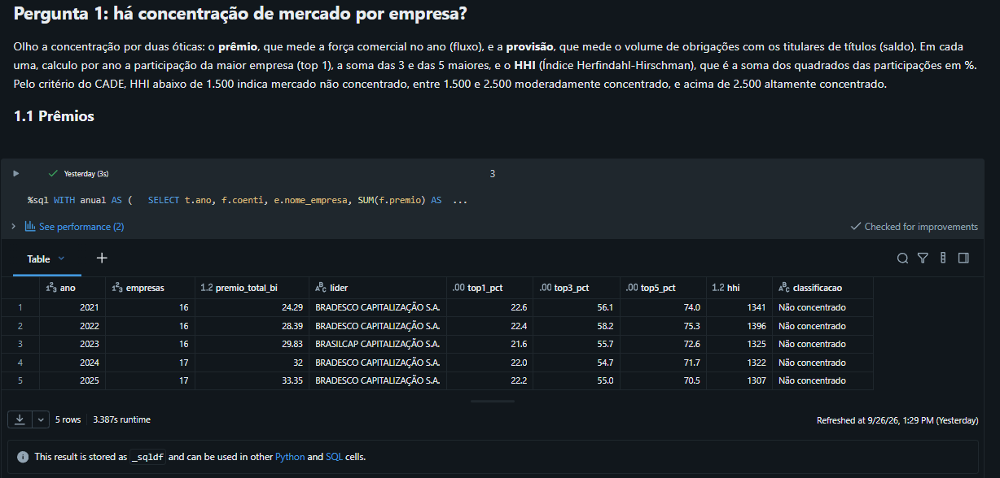

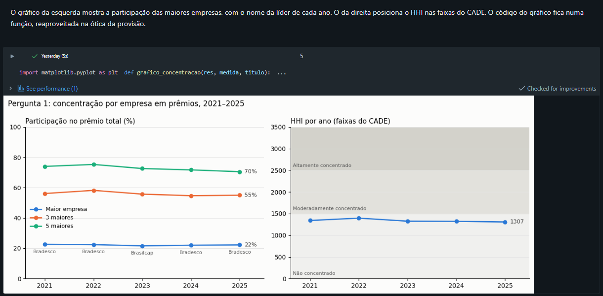

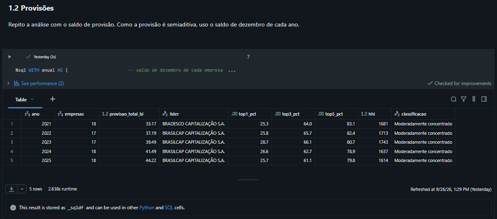

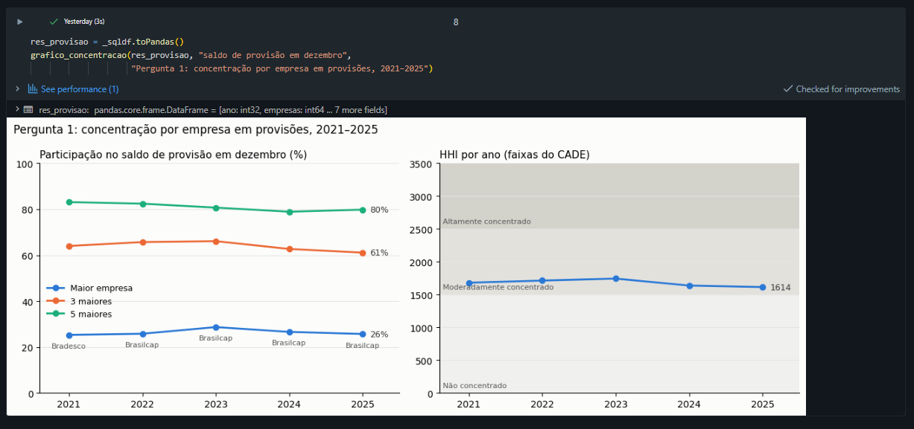

#### Discussão

| Ótica | Top 1 | Top 3 | Top 5 | HHI | Classificação (CADE) |
|---|---|---|---|---|---|
| Prêmios (fluxo do ano) | 22–23% | 55–58% | 70–75% | 1.307–1.396 | Não concentrado |
| Provisões (saldo em dezembro) | 25–29% | 61–66% | 79–83% | 1.614–1.743 | Moderadamente concentrado |

**Há concentração, e o grau depende da ótica.** Em prêmios, o mercado não é concentrado pelo HHI, mas a liderança é compartilhada: as 3 maiores empresas respondem por mais da metade das vendas. Nenhuma empresa domina sozinha (a maior tem cerca de 22%). Em provisões, a concentração é maior e o mercado é moderadamente concentrado: as líderes detêm uma fatia maior das obrigações com os titulares do que das vendas do ano.

**Liderança.** Em provisões, a Bradesco liderou em 2021 e a Brasilcap de 2022 a 2025. Em prêmios, a Bradesco liderou em todos os anos, exceto 2023, quando a Brasilcap ficou à frente.

**Evolução.** Nas duas óticas, a concentração atinge o pico em 2022–2023 e recua levemente depois: o HHI de prêmios cai de 1.396 (2022) para 1.307 (2025), e o de provisões de 1.743 (2023) para 1.614 (2025). No mesmo período, o mercado cresceu: o prêmio anual passou de R$ 24,3 bi para R$ 33,4 bi, e o saldo de provisões de R$ 33,2 bi para R$ 44,2 bi.

**Por que as óticas divergem.** O prêmio mede o que foi vendido no ano, e a provisão, o que se acumulou ao longo do tempo. As líderes captam volumes maiores ano após ano, e nem todo o saldo sai: parte dos titulares mantém os títulos ou não resgata os valores. Assim, o saldo das maiores companhias cresce mais que o das demais, e a concentração que o fluxo de um único ano não evidencia aparece na provisão.

### Pergunta 2 — O mercado é concentrado geograficamente?

Comparo a participação de cada UF no prêmio total no primeiro e no último ano do período (2021 e 2025), com a região de cada uma. Assim vejo quais UFs concentram o mercado, quanto as regiões representam e se essa distribuição mudou.

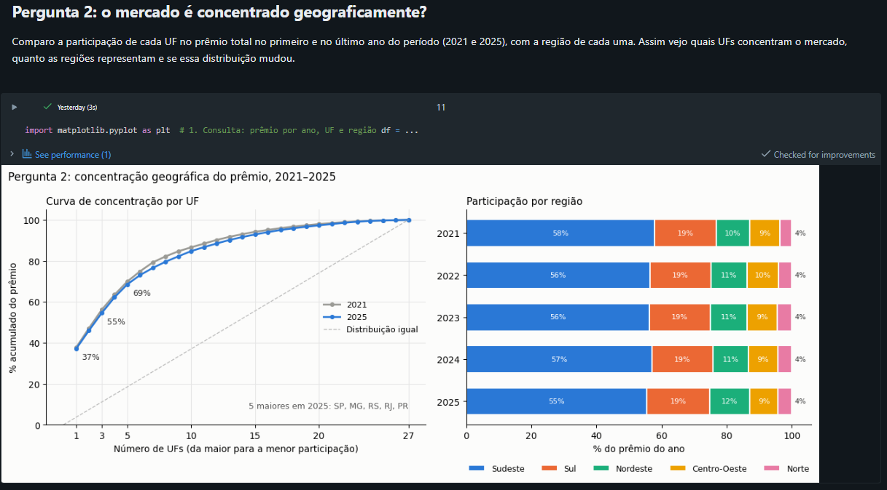

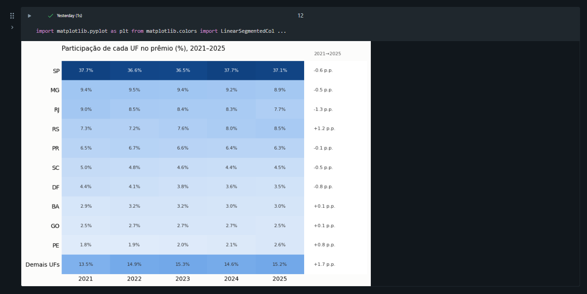

#### Discussão

| Indicador | 2021 | 2025 |
|---|---|---|
| Maior UF (SP) | 37,7% | 37,1% |
| 5 maiores UFs | 70% | 69% |
| Sudeste | 58% | 55% |
| Sul | 19% | 19% |
| Nordeste | 10% | 12% |
| Centro-Oeste | 9% | 9% |
| Norte | 4% | 4% |

**O mercado é concentrado geograficamente.** São Paulo sozinho responde por mais de um terço do prêmio, e 5 UFs (SP, MG, RS, RJ e PR) somam cerca de 70%. Por região, o Sudeste concentra mais da metade do mercado, e Sudeste e Sul juntos passam de 70%. Essa distribuição acompanha o peso econômico das regiões, onde está a maior parte da renda e da base de clientes.

**A concentração mudou pouco.** A curva de concentração de 2025 fica ligeiramente abaixo da de 2021. O Sudeste perdeu 3 p.p., com ganhos pulverizados entre as demais regiões, e SP se manteve entre 36,5% e 37,7%.

### Pergunta 3 — Quais modalidades têm maior representatividade e como a composição evoluiu?

Uso as receitas do arquivo de modalidades (`Ses_Dados_Cap`), que correspondem aos prêmios: arrecadação líquida de devoluções e cancelamentos. Aplico o recorte descrito acima (sem os códigos 0 e 5), e o peso dessas modalidades é informado no gráfico. À esquerda, a participação de cada modalidade nas receitas de cada ano; à direita, o valor em R$ bilhões, para separar mudança de composição de crescimento.

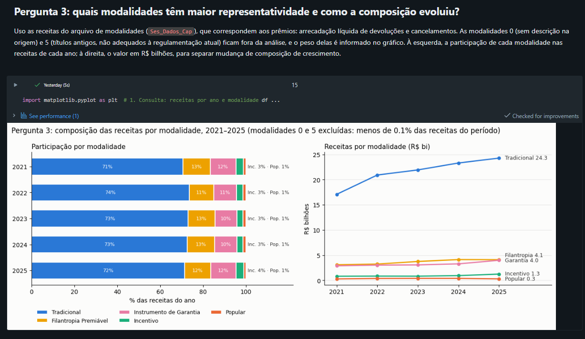

#### Discussão

| Modalidade | Participação 2021 | Participação 2025 | Receitas 2021 (R$ bi) | Receitas 2025 (R$ bi) |
|---|---|---|---|---|
| Tradicional | 71% | 72% | 17,1 | 24,3 |
| Filantropia Premiável | 13% | 12% | 3,1 | 4,1 |
| Instrumento de Garantia | 12% | 12% | 2,9 | 4,0 |
| Incentivo | 3% | 4% | 0,8 | 1,3 |
| Popular | 1% | 1% | 0,3 | 0,3 |

**A modalidade Tradicional domina o mercado.** Ela responde por mais de 70% das receitas em todos os anos (entre 71% e 74%). Filantropia Premiável e Instrumento de Garantia vêm em seguida, com 10% a 13% cada, e Incentivo e Popular somam menos de 5%. As modalidades excluídas (0 e 5) representam menos de 0,1% das receitas do período, o que confirma que o recorte não afeta o resultado.

**A composição se manteve estável no período.** A ordem das modalidades é a mesma em todos os anos, e as participações variam poucos pontos percentuais.

### Pergunta 4 — A receita de cada empresa se concentra em poucas modalidades? Quem lidera cada modalidade?

Uso a soma das receitas de 2021 a 2025 da `fato_modalidade`, com o mesmo recorte da pergunta 3 (sem os códigos 0 e 5).

Calculo dois percentuais para cada par empresa × modalidade:

| Percentual | Pergunta que responde | Soma 100% em |
|---|---|---|
| `pct_na_modalidade` | Quanto a empresa representa dentro da modalidade? (quem lidera) | Cada modalidade |
| `pct_na_empresa` | Quanto a modalidade pesa na receita da empresa? (concentração da carteira) | Cada empresa |

As duas contas usam a mesma função de janela `SUM() OVER`; só muda o `PARTITION BY`, por modalidade ou por empresa. Deixo de fora os pares com receita total negativa ou zero no período (`HAVING`), porque um valor negativo distorceria as participações.

Para visualizar, monto dois mapas de calor lado a lado, com as empresas nas linhas (da maior para a menor em receitas) e as modalidades nas colunas. No da esquerda, cada coluna soma 100% e mostra quem lidera cada modalidade. No da direita, cada linha soma 100% e mostra o mix de cada empresa. Célula vazia = a empresa não atua na modalidade; "<1" = atua, mas com menos de 1%.

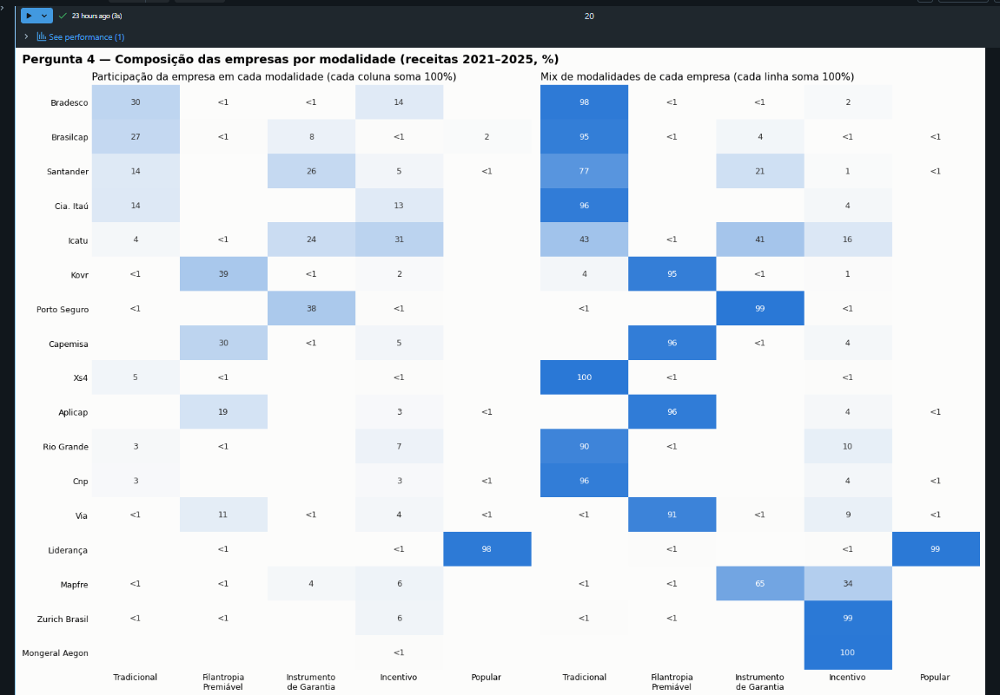

#### Discussão

| Modalidade | Líderes (participação na modalidade) | Empresas com 1% ou mais |
|---|---|---|
| Tradicional | Bradesco 30%, Brasilcap 27%, Itaú 14%, Santander 14% | 8 |
| Filantropia Premiável | Kovr 39%, Capemisa 30%, Aplicap 19%, Via 11% | 4 |
| Instrumento de Garantia | Porto Seguro 38%, Santander 26%, Icatu 24% | 5 |
| Incentivo | Icatu 31%, Bradesco 14%, Itaú 13% | 12 |
| Popular | Liderança 98% | 2 |

**Resposta:** a receita das empresas é concentrada. Em 14 das 17 empresas, uma única modalidade responde por 90% ou mais da receita (painel da direita). Só três têm a receita distribuída de forma relevante: Icatu (Tradicional 43%, Garantia 41%, Incentivo 16%), Santander (Tradicional 77%, Garantia 21%) e Mapfre (Garantia 65%, Incentivo 34%).

Receita concentrada não significa que a empresa atue em uma modalidade só. Várias aparecem em quase todas, mas com volume pequeno fora da predominante. Os dados da SUSEP mostram onde está a receita, não as iniciativas comerciais de cada companhia.

**Quem lidera:** cada modalidade tem o seu próprio grupo de líderes, e os grupos quase não se misturam. As quatro líderes da Tradicional pertencem a grupos bancários e somam 85% da modalidade. Nenhuma delas tem participação relevante na Filantropia Premiável, onde quatro empresas (Kovr, Capemisa, Aplicap e Via) somam 99%. O Instrumento de Garantia é liderado pela Porto Seguro, a Popular é praticamente exclusiva da Liderança (98%), e o Incentivo é a modalidade mais disputada, com 12 empresas acima de 1% e líder com 31%.

**Relação com a pergunta 1:** no mercado como um todo, os prêmios não são concentrados pelo HHI. Por modalidade, o quadro muda: como a receita de cada empresa se concentra em poucas modalidades, a disputa acontece dentro de cada uma, entre poucos participantes relevantes. Para o posicionamento de portfólio, crescer numa modalidade significa enfrentar um grupo pequeno e já estabelecido de líderes, e não o mercado inteiro.

### Conclusão

O objetivo era entender a estrutura do mercado de capitalização de 2021 a 2025: quem concentra, onde e com quais produtos. Os dados mostram um mercado estável, dominado por um produto e por uma região, em que a competição se organiza por modalidade.

| Eixo | Resposta |
|---|---|
| **Quem** (P1) | Poucas empresas lideram. As 3 maiores detêm mais da metade dos prêmios, e as 5 maiores, de 70% a 75%. Pelo HHI, o mercado de prêmios não é concentrado, mas o de provisões é moderadamente concentrado, com as 5 maiores somando cerca de 80%. A Bradesco lidera em prêmios (exceto em 2023), e a Brasilcap em provisões desde 2022 |
| **Onde** (P2) | O Sudeste domina, com mais da metade dos prêmios (55% a 58%), e São Paulo sozinho responde por mais de um terço. Sudeste e Sul somam mais de 70%, e as outras três regiões juntas ficam em cerca de um quarto. O quadro se manteve ao longo do período |
| **Com quais produtos** (P3) | A Tradicional domina, com cerca de 72% das receitas. Filantropia Premiável e Instrumento de Garantia vêm em seguida, com cerca de 12% cada, e Incentivo e Popular somam menos de 5%. A composição se manteve estável |
| **Quem lidera cada produto** (P4) | Cada modalidade tem o seu próprio grupo de líderes: na Tradicional, Bradesco, Brasilcap, Itaú e Santander somam 85%; na Filantropia Premiável, Kovr, Capemisa, Aplicap e Via somam 99%; no Instrumento de Garantia, Porto Seguro, Santander e Icatu somam 88%; e na Popular, a Liderança tem 98%. Em 14 das 17 empresas, uma única modalidade responde por 90% ou mais da receita |

**Visão integrada.** Os quatro recortes contam a mesma história: o mercado gira em torno do título Tradicional, liderado por empresas de grupos bancários, com a demanda concentrada no Sudeste. O HHI de prêmios, abaixo de 1.500, não capta isso sozinho. A concentração aparece quando se olha por produto, porque cada modalidade é disputada por poucas empresas. O quadro também é estável: em cinco anos, a liderança, a distribuição regional e a composição dos produtos mudaram pouco.

**Para o planejamento**, a posição competitiva deve ser avaliada por modalidade, e não só no mercado total, porque é dentro de cada modalidade que a disputa acontece.

---

## Autoavaliação

Comecei o MVP com um objetivo claro: entender a estrutura do mercado de capitalização entre 2021 e 2025 (quem concentra, onde e com quais produtos) usando dados públicos da SUSEP e construindo o pipeline inteiro na nuvem. Esse objetivo foi atingido. As quatro perguntas foram respondidas, e o caminho até elas está documentado: carga controlada por um manifesto, modelo dimensional na Gold, catálogo registrado no README e no Unity Catalog, e checagens de qualidade depois de cada transformação.

Foi meu primeiro projeto no Databricks. Unity Catalog, Volumes, tabelas Delta e Git Folder eram conceitos novos, e por isso construí o pipeline aos poucos, uma célula por vez, avançando só quando entendia o que cada etapa fazia. Mesmo com esse cuidado, um detalhe da carga só apareceu mais tarde: o `Ses_cias` estava em Windows-1252, e não em ISO-8859-1 como eu tinha registrado, e um nome de empresa com apóstrofo saiu com caractere inválido. Tive de voltar, corrigir a leitura e atualizar o manifesto.

A parte mais difícil foi a modelagem. O esquema estrela que vemos em sala tem uma fato no centro e as dimensões em volta, mas os dados da SUSEP chegam em três grãos diferentes (por UF, por modalidade e só por empresa), que não se combinam numa fato só. Precisei entender que o caminho era manter três fatos compartilhando as mesmas dimensões, e decidir o que cada uma guardaria. A provisão trouxe outro cuidado: por ser saldo, e não fluxo, não pode ser somada ao longo do ano. Também descobri que o Databricks não valida chaves primárias e estrangeiras, e por isso confirmei a unicidade e a integridade referencial com consultas próprias.

Há três caminhos que eu seguiria para evoluir o trabalho. O primeiro é automatizar o que hoje ainda é manual, a começar pela captura: um notebook de ingestão poderia baixar o ZIP do portal do SES, extrair os quatro arquivos e gravá-los no Volume, eliminando o download e o upload feitos à mão. Um Job agendado para o ciclo mensal de publicação da SUSEP executaria a ingestão e os notebooks seguintes em ordem, e as regras que conferi com consultas (contagem contra o manifesto, unicidade e integridade referencial) virariam validações automáticas que interrompem a carga quando falham. O segundo é tirar o MVP do modo "análise pontual": com o período parametrizado e a Gold sempre atualizada, um painel no próprio Databricks permitiria acompanhar a concentração do mercado mês a mês. O terceiro é enriquecer a análise com dados contábeis das companhias, como resultado, despesas e patrimônio. Hoje os dados mostram onde está a receita; com as informações contábeis, daria para entender também como cada empresa transforma essa receita em resultado.
